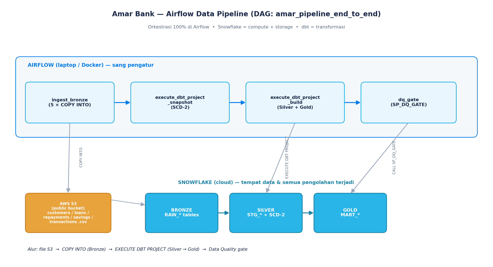

# Session 1 — Data Engineering (3 LAB Bertahap, untuk Pemula)

> Dibuat **bertahap** supaya mudah: **LAB 1** load data manual (COPY INTO) → **LAB 2** bangun
> transformasi dbt di Snowflake Workspace → **LAB 3** gabungkan semua jadi pipeline otomatis di Airflow.
> Baca pelan-pelan dari atas, jangan loncat.

🎯 **Tujuan akhir:** memahami tiap potongan dulu (LAB 1 & 2 manual), baru menggabungkannya jadi
pipeline otomatis (LAB 3).

---

## PETA BESAR (baca dulu — 3 menit)

3 "pemain" seperti dapur restoran:
| Pemain | Analogi | Perannya |
|--------|---------|----------|
| **Snowflake** | Dapur + gudang | Tempat data disimpan & semua pengolahan terjadi |
| **dbt** | Buku resep | Resep SQL untuk mengubah data mentah → rapi |
| **Airflow** | Kepala koki | Mengatur urutan & menyuruh Snowflake bekerja (baru dipakai di LAB 3) |

```
LAB 1 (manual)         LAB 2 (manual, di Snowflake Workspace)        LAB 3 (otomatis, Airflow)
S3 ──COPY INTO──► BRONZE   BRONZE ──dbt──► SILVER ──dbt──► GOLD       COPY INTO → EXECUTE DBT PROJECT → DQ
```



**Prasyarat umum:** Session 0 selesai (sudah jalankan `sql/00_setup.sql` → DB/schema/warehouse ada).

---

# LAB 1 — Load Data S3 → Snowflake dengan COPY INTO (standard)

🎯 **Tujuan:** memahami cara paling dasar memasukkan file dari S3 ke tabel Snowflake, **manual**.

### Konsep (1 menit)
- **Stage** = "pintu" antara file S3 & Snowflake.
- **File Format** = aturan baca file (CSV pakai header, pemisah koma).
- **COPY INTO** = perintah menyalin isi file ke tabel.
- **BRONZE** = data mentah apa adanya.

### Langkah 1.1 — Buat struktur (stage + tabel)
👉 Buka `sql/01_ingestion.sql`. Ganti placeholder `<<S3_BUCKET>>` & `<<S3_PREFIX>>` sesuai bucket Anda.
Jalankan **BAGIAN 1** (CREATE STAGE + CREATE TABLE).
```sql
LIST @BRONZE.STG_S3_AMAR;   -- cek file kebaca
```
👀 **Yang harus dilihat:** daftar file `customers.csv`, `loans.csv`, dst. **Artinya Snowflake bisa "melihat" file di S3.**

### Langkah 1.2 — COPY INTO (hands-on inti LAB ini)
👉 Jalankan **BAGIAN 2** (5 perintah COPY INTO) di file yang sama.
```sql
SELECT 'RAW_CUSTOMERS' t, COUNT(*) n FROM BRONZE.RAW_CUSTOMERS
UNION ALL SELECT 'RAW_LOANS', COUNT(*) FROM BRONZE.RAW_LOANS;
```
👀 **Yang harus dilihat:** tiap COPY berstatus `LOADED`; customers 5.000, loans 8.000.
**🎉 Anda baru saja memuat data S3 ke Snowflake secara manual.**

> 💡 Di LAB ini kita COPY manual untuk **belajar**. Nanti di **LAB 3**, COPY INTO ini
> dijalankan **otomatis oleh Airflow** — Anda tidak mengetik ulang.

### (Opsional) Demo Schema Evolution
👉 Jalankan blok berkomentar yang me-load `customers_v2_schemadrift.csv` (punya kolom baru).
👀 Kolom baru muncul otomatis tanpa error.

✅ **Selesai LAB 1.** Tabel BRONZE sudah terisi.

---

# LAB 2 — Bangun dbt Project di Snowflake Workspace (UI), lalu Deploy

🎯 **Tujuan:** mengubah data BRONZE → SILVER → GOLD memakai **dbt yang berjalan DI DALAM Snowflake**,
dibuat lewat **Workspace** (web IDE di Snowsight) — **tanpa** install apa pun, **tanpa** `snow dbt deploy`.

### Konsep (2 menit)
- **dbt** = alat transformasi pakai SQL + test + dokumentasi.
- **Workspace** = web IDE di Snowsight untuk membuat/menjalankan dbt project langsung di Snowflake
  (bisa connect Git atau upload file).
- **DBT PROJECT object** = hasil "deploy" dari Workspace → objek di Snowflake yang bisa dijalankan
  dengan `EXECUTE DBT PROJECT`. **Inilah yang nanti dipanggil Airflow di LAB 3.**

> Alur resmi dbt-on-Snowflake: project valid → `dbt deps` → **deploy** (buat DBT PROJECT object)
> → `EXECUTE DBT PROJECT`. (Sumber: docs.snowflake.com/.../dbt-projects-on-snowflake)

### Langkah 2.1 — Buka Workspaces & buat dbt project
👉 **Langkah:**
1. Snowsight → menu kiri **Projects → Workspaces**.
2. Klik **+ Add new** → pilih **dbt Project** (atau "From Git" bila ingin connect repo GitHub).
   Untuk workshop, pilih buat baru / upload.
3. Beri nama workspace, pilih **Database `AMAR_WORKSHOP`**, **Schema `SILVER`**, **Warehouse `AMAR_WORKSHOP_WH`**, **Role `AMAR_DATA_ENGINEER`**.

👀 **Yang harus dilihat:** editor Workspace terbuka (kiri = daftar file, kanan = editor).

### Langkah 2.2 — Masukkan file dbt project kita
👉 Pilih salah satu:
- **(A) Upload:** upload isi folder `dbt/` repo ini (`dbt_project.yml`, `profiles.yml`,
  `models/`, `snapshots/`). **atau**
- **(B) From Git:** hubungkan repo `https://github.com/arzamuhammad/amar-bank-snowflake-workshop`
  dan arahkan ke folder `dbt/`.

👀 **Yang harus dilihat:** struktur file dbt muncul: `models/staging/*.sql`, `models/gold/*.sql`,
`snapshots/`, `dbt_project.yml`.

> ℹ️ Di Workspace, **koneksi diurus Snowflake sendiri** (pakai role/warehouse Anda) — jadi
> `profiles.yml` tidak perlu account/user. Nilai database/schema/warehouse di `profiles.yml`
> sudah diisi untuk Amar.

### Langkah 2.3 — Install dependency & jalankan dbt (uji di Workspace)
👉 Di toolbar Workspace, jalankan perintah dbt berurutan (ada tombol/CLI dbt di Workspace):
```
dbt deps        # pasang dependency (project ini tanpa package eksternal → cepat/no-op)
dbt build       # bangun staging → marts + jalankan semua test
dbt snapshot    # bangun DIM_CUSTOMERS_SCD2 (riwayat perubahan)
```
👀 **Yang harus dilihat:** log dbt: model `stg_customers`, `stg_loans`, lalu `mart_loan_performance`,
`mart_customer_360` dibuat; test **PASS**. Cek di worksheet:
```sql
SELECT * FROM AMAR_WORKSHOP.GOLD.MART_LOAN_PERFORMANCE LIMIT 5;
```
**🎉 Transformasi berhasil — dan ini berjalan di dalam Snowflake.**

### Langkah 2.4 — DEPLOY jadi DBT PROJECT object
🎯 Supaya bisa dipanggil otomatis (oleh Airflow di LAB 3), kita **deploy** project dari Workspace.

👉 **Langkah:** di Workspace, klik tombol **Deploy** (atau **Create dbt project object**),
arahkan ke **Database `AMAR_WORKSHOP`, Schema `SILVER`**, nama objek **`AMAR_WORKSHOP`**.

👀 **Yang harus dilihat:** muncul DBT PROJECT object. Verifikasi di worksheet:
```sql
SHOW DBT PROJECTS IN SCHEMA AMAR_WORKSHOP.SILVER;
-- coba jalankan langsung:
EXECUTE DBT PROJECT AMAR_WORKSHOP.SILVER.AMAR_WORKSHOP ARGS='build';
```
👀 Muncul 1 baris project, dan `EXECUTE DBT PROJECT` berjalan. **Inilah yang akan dipanggil Airflow.**

> 🔁 **Alternatif terminal** (kalau lebih suka CLI): `snow dbt deploy ...` — perlu `snow` CLI,
> lihat [GUIDE_SNOWCLI_SETUP.md](GUIDE_SNOWCLI_SETUP.md). Tapi untuk workshop, **cara UI Workspace di atas sudah cukup.**

✅ **Selesai LAB 2.** Sekarang ada: data Bronze (LAB 1) + transformasi dbt yang ter-deploy (LAB 2).

---

# LAB 3 — Bangun Data Pipeline: gabungkan semua dengan Airflow

🎯 **Tujuan:** menyatukan LAB 1 (COPY INTO) + LAB 2 (EXECUTE DBT PROJECT) + cek kualitas menjadi
**satu pipeline otomatis** yang dijalankan Airflow sekali klik.

### Langkah 3.1 — Pasang prasyarat
1. **Airflow lokal** sudah menyala → lihat `../airflow/SETUP_AIRFLOW.md` (`astro dev start`).
2. **DBT PROJECT object sudah ada** dari LAB 2 (cek `SHOW DBT PROJECTS IN SCHEMA AMAR_WORKSHOP.SILVER;`).
3. **Key-pair RSA** sudah dibuat & public key terdaftar di user Snowflake (untuk Airflow Connection).

> ❓ **"Apakah Airflow butuh `snow` CLI untuk menjalankan EXECUTE DBT PROJECT?"**
> **TIDAK.** Airflow konek ke Snowflake lewat **Airflow Connection (key-pair)** memakai
> Snowflake Python connector. `EXECUTE DBT PROJECT` hanyalah **perintah SQL** yang dikirim
> lewat koneksi itu — jadi `snow` CLI **tidak perlu** dipasang untuk pipeline ini.
> `snow` CLI hanya **opsional** (kalau Anda mau deploy/verifikasi dari terminal) →
> [GUIDE_SNOWCLI_SETUP.md](GUIDE_SNOWCLI_SETUP.md). Untuk workshop, **lewati saja.**

### Langkah 3.2 — Beri Airflow "kunci" ke Snowflake (Connection)
> Airflow di laptop, Snowflake di cloud — belum saling kenal. Connection = alamat + kunci.

👉 Airflow UI → **Admin → Connections → +**:
- **Connection Id:** `snowflake_default` (harus persis ini)
- **Connection Type:** `Snowflake`
- **Account:** `<YOUR_SNOWFLAKE_ACCOUNT>` • **Login:** `<username>`
- **Database:** `AMAR_WORKSHOP` • **Schema:** `BRONZE` • **Warehouse:** `AMAR_WORKSHOP_WH` • **Role:** `AMAR_DATA_ENGINEER`
- **Extra:** `{"private_key_file": "/usr/local/airflow/include/snowflake_key.p8"}`

👀 Klik **Save** → (opsional **Test**) → muncul sukses.

### Langkah 3.3 — Jalankan pipeline penuh
👉 Airflow UI → DAGs → buka **`amar_pipeline_end_to_end`** → tab **Graph**:
```
ingest_bronze (5 × COPY INTO)
        ↓
execute_dbt_project_snapshot   →  EXECUTE DBT PROJECT ... ARGS='snapshot'
        ↓
execute_dbt_project_build      →  EXECUTE DBT PROJECT ... ARGS='build'
        ↓
dq_gate                        →  CALL SP_DQ_GATE()
```
Nyalakan toggle, klik **▶ Trigger**.

👀 **Yang harus dilihat:** kotak menyala hijau berurutan kiri→kanan. Klik task → **Logs** untuk
lihat perintah yang dikirim ke Snowflake. **Inilah pipeline lengkap: COPY INTO → EXECUTE DBT PROJECT → DQ.**

> 💡 **Kenapa Airflow, bukan Snowflake Tasks?** Banyak tim DE pakai Airflow sebagai **satu**
> pengatur untuk semua sistem. Jadwal/urutan/retry/alert terpusat di Airflow; Snowflake jadi mesin pengolah.

### Langkah 3.4 — Pantau & kalau gagal
- **Grid view:** hijau=sukses, merah=gagal → klik → **Logs**.
- Tabel troubleshooting:

| Gejala | Solusi |
|--------|--------|
| Task merah: *No connection snowflake_default* | Connection belum dibuat / id salah → Langkah 3.2 |
| Task merah: *authentication failed / JWT invalid* | Key-pair/akun → cek GUIDE_SNOWCLI_SETUP.md bagian D & F |
| `execute_dbt_project_*` gagal: *DBT PROJECT not found* | Belum deploy di LAB 2 → ulangi Langkah 2.4 |
| `copy_*` sukses tapi 0 rows | File belum di S3 / path stage salah → `LIST @BRONZE.STG_S3_AMAR;` |

---

## RINGKASAN URUTAN (cheat-sheet)
```
LAB 1 (Snowflake worksheet):
  - 00_setup.sql  →  01_ingestion.sql BAGIAN 1 (stage+tabel)  →  BAGIAN 2 (COPY INTO manual)

LAB 2 (Snowsight Workspaces, UI):
  - buat dbt project  →  upload/Git folder dbt/  →  dbt deps/build/snapshot  →  DEPLOY (DBT PROJECT object)

LAB 3 (Airflow):
  - astro dev start  →  buat Connection snowflake_default (key-pair)
  - Trigger DAG amar_pipeline_end_to_end  →  COPY INTO → EXECUTE DBT PROJECT → DQ
  - (snow CLI TIDAK wajib; hanya opsional untuk deploy/verifikasi dari terminal)
```

➡️ Lanjut ke **[Session 2 — Analytics + Build Streamlit pakai AI](GUIDE_SESSION2_ANALYTICS.md)**.
